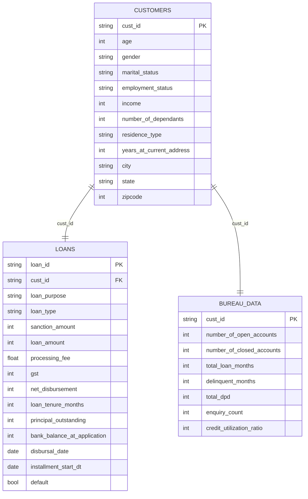
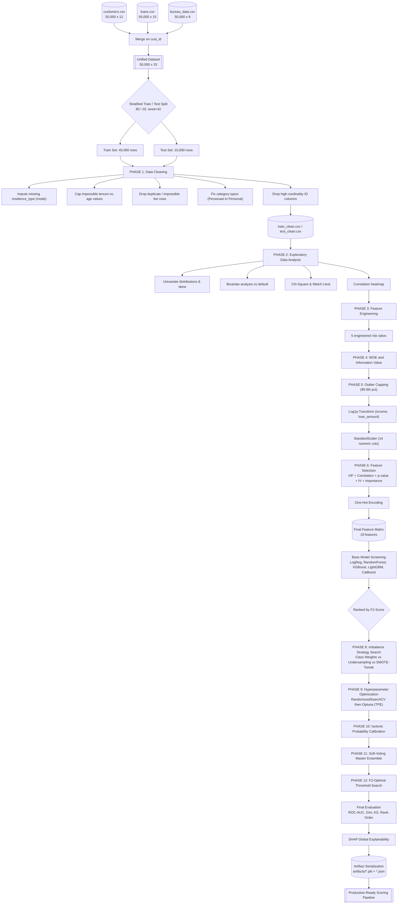
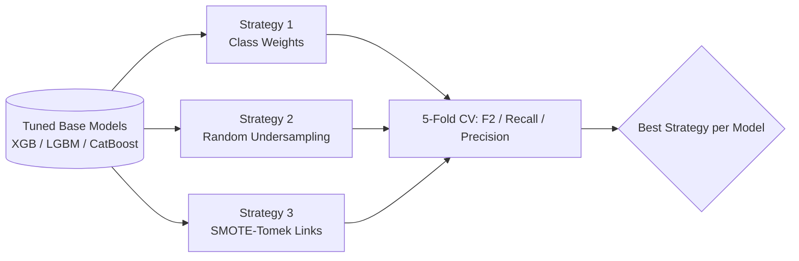
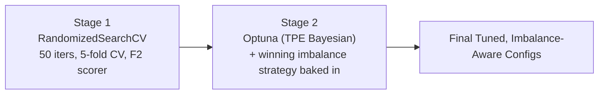
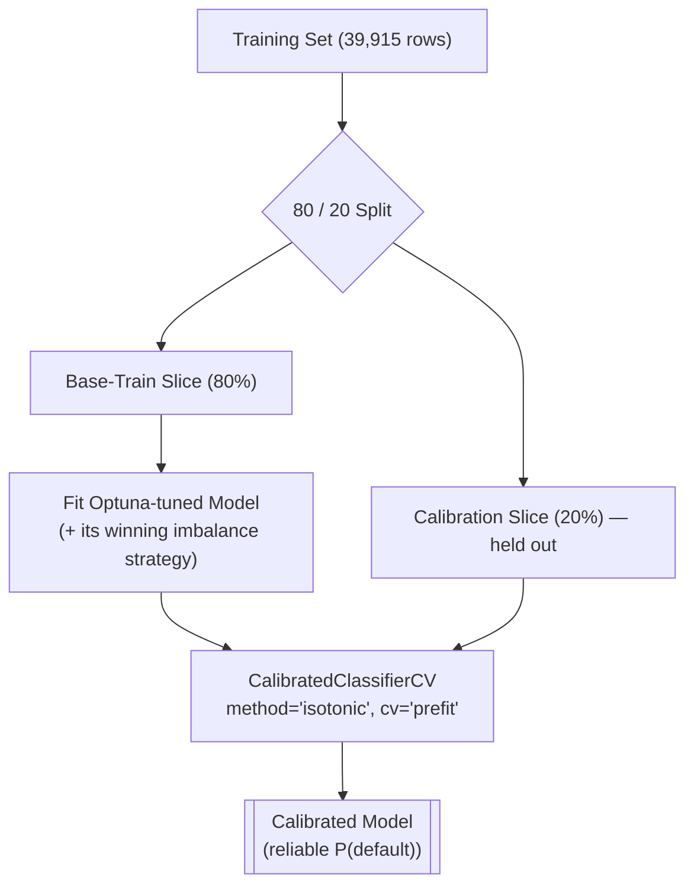
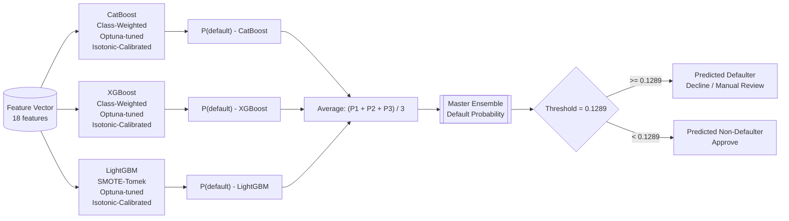

<div align="center">

# 🏦 Sierra Finance — Credit Risk Modelling

### An End-to-End Machine Learning System for Loan Default Prediction & Risk-Based Underwriting


**ROC-AUC 0.9883 · Gini 0.977 · KS-Statistic 87.4% · Recall @ Optimal Threshold 96.2%**

[Overview](#overview) · [Pipeline](#end-to-end-ml-pipeline) · [Dataset](#dataset-overview) · [Modelling](#model-training--selection) · [Results](#final-model-performance) · [Explainability](#model-explainability-shap) · [Getting Started](#getting-started)

</div>

---

## 📌 Table of Contents

1. [Overview](#overview)
2. [Business Problem](#business-problem)
3. [Key Results at a Glance](#key-results-at-a-glance)
4. [Repository Structure](#repository-structure)
5. [Dataset Overview](#dataset-overview)
6. [End-to-End ML Pipeline](#end-to-end-ml-pipeline)
7. [Phase 1 — Data Cleaning & Integrity Checks](#phase-1--data-cleaning--integrity-checks)
8. [Phase 2 — Exploratory Data Analysis](#phase-2--exploratory-data-analysis)
9. [Phase 3 — Feature Engineering](#phase-3--feature-engineering)
10. [Phase 4 — Weight of Evidence & Information Value](#phase-4--weight-of-evidence--information-value)
11. [Phase 5 — Outlier Treatment, Transformation & Scaling](#phase-5--outlier-treatment-transformation--scaling)
12. [Phase 6 — Feature Selection](#phase-6--feature-selection)
13. [Model Training & Selection](#model-training--selection)
14. [Phase 8 — Class Imbalance Handling](#phase-8--class-imbalance-handling)
15. [Phase 9 — Hyperparameter Optimization](#phase-9--hyperparameter-optimization)
16. [Phase 10 — Probability Calibration](#phase-10--probability-calibration)
17. [Phase 11 — Master Ensemble Architecture](#phase-11--master-ensemble-architecture)
18. [Phase 12 — Business Cost-Based Threshold Optimization](#phase-12--business-cost-based-threshold-optimization)
19. [Final Model Performance](#final-model-performance)
20. [Rank Ordering & KS Statistic](#rank-ordering--ks-statistic)
21. [Model Explainability (SHAP)](#model-explainability-shap)
22. [Data Leakage Safeguards](#data-leakage-safeguards)
23. [Saved Artifacts / Model Registry](#saved-artifacts--model-registry)
24. [Tech Stack](#tech-stack)
25. [Getting Started](#getting-started)
26. [Limitations & Assumptions](#limitations--assumptions)
27. [Future Work](#future-work)
28. [License](#license)

---

## Overview

**Sierra Finance — Credit Risk Modelling** is a full-cycle, production-grade credit default prediction system built on 50,000 loan accounts. It takes raw, siloed customer/loan/bureau records all the way to a **calibrated, explainable, cost-optimized master ensemble model** ready for deployment inside a loan origination or underwriting workflow.

This isn't just "train a classifier and report accuracy." The project follows the discipline of a real-world credit risk / lending-domain ML system:

- 🧹 **Rigorous, leakage-aware data cleaning** with logic-based (not just statistical) outlier detection
- 📊 **Deep univariate/bivariate EDA** with formal hypothesis testing (Chi-Square, Welch's t-test)
- 🛠️ **Domain-driven feature engineering** (5 ratio-based risk indicators)
- 📈 **Weight of Evidence (WOE) & Information Value (IV)** — the credit-scoring industry standard for feature strength
- 🧬 **Multi-method feature selection** — VIF (multicollinearity), correlation, p-values, model-based importance, and IV, triangulated together
- 🤖 **5-model base screening → 3-model tuned ensemble** (CatBoost + XGBoost + LightGBM)
- ⚖️ **3 imbalance-handling strategies** benchmarked head-to-head (Class Weights vs. Undersampling vs. SMOTE-Tomek)
- 🎯 **Two-stage hyperparameter optimization** — `RandomizedSearchCV` for the initial sweep, `Optuna` (Bayesian/TPE) for final fine-tuning
- 🎚️ **Isotonic probability calibration** on a held-out calibration slice, so predicted probabilities are actually meaningful
- 🧩 **Soft-voting Master Ensemble** — three de-correlated, calibrated models averaged for a "wisdom of crowds" score
- 💰 **Business cost-based decision threshold** — F2-score optimized because in lending, missing a defaulter (False Negative) costs far more than rejecting a good customer (False Positive)
- 📉 **Credit-scoring-grade evaluation** — ROC-AUC, Gini Coefficient, decile Rank-Ordering, and the **Kolmogorov–Smirnov (KS) statistic**
- 🧠 **SHAP-based global explainability** for regulatory/stakeholder transparency
- 💾 **Fully serialized inference pipeline** — scaler, encoders, calibrated models, thresholds, and SHAP explainer all persisted as artifacts

---

## Business Problem

Sierra Finance is a lending institution that needs to decide, **at the time of loan application**, how likely a borrower is to default. Two types of mistakes are possible, and they are **not equally costly**:

| Error Type | Business Meaning | Cost |
|---|---|---|
| **False Negative** (model says "safe," borrower defaults) | Loan is disbursed to a defaulter | 🔴 **Loss of entire principal** |
| **False Positive** (model says "risky," borrower was actually safe) | A good customer is declined or flagged for manual review | 🟡 Loss of potential interest income only |

Because a missed defaulter is dramatically more expensive than a false alarm, the entire modelling strategy — from imbalance handling through the final decision threshold — is deliberately biased toward **maximizing recall on the default class without collapsing precision**, using the **F2-score** (which weights recall 4× more than precision) as the guiding optimization metric.

---

## Key Results at a Glance

| Metric | Value | Interpretation |
|---|---|---|
| **ROC-AUC** (Master Ensemble) | **0.9883** | Near-perfect separation between defaulters and non-defaulters |
| **Gini Coefficient** | **0.9765** | `2 × AUC − 1`; excellent rank-ordering power |
| **KS Statistic (max)** | **87.39%** at decile 8 | Far above the ~40% "good" / ~60%+ "excellent" industry benchmark for credit scorecards |
| **Top-2-decile Capture Rate** | **99.88%** of all defaulters | Nearly every defaulter falls in the riskiest 20% of applicants |
| **Optimal Decision Threshold** | **0.1289** (12.9%) | Chosen by maximizing F2-score on the precision-recall curve |
| **Recall @ Optimal Threshold** | **96.2%** | Catches 96 out of every 100 actual defaulters |
| **Precision @ Optimal Threshold** | **59.5%** | ~6 in 10 flagged applicants are true defaulters |
| **F2-Score @ Optimal Threshold** | **0.856** | Business-aligned composite metric |
| **Base Rate (Default Prevalence)** | **8.6%** | Heavily imbalanced target — handled explicitly (see Phase 8) |

---

## Repository Structure

```
sierra-finance-credit-risk/
│
├── data/
│   ├── customers.csv                  # Raw customer demographic data (50,000 × 12)
│   ├── loans.csv                      # Raw loan/transaction data (50,000 × 15)
│   ├── bureau_data.csv                # Raw credit bureau data (50,000 × 8)
│   ├── train_clean.csv                # Cleaned training set (post Phase 1)
│   └── test_clean.csv                 # Cleaned hold-out test set (post Phase 1)
│
├── notebooks/
│   └── Sierra_Finance_Credit_Risk_Modelling.ipynb   # Full, single-notebook pipeline (245 cells)
│
├── artifacts/                         # Serialized inference-ready pipeline (see full table below)
│   ├── feature_engineering.pkl
│   ├── preprocessing_config.pkl
│   ├── model_columns.pkl
│   ├── scaler.pkl
│   ├── calibrated_cat.pkl
│   ├── calibrated_xgb.pkl
│   ├── calibrated_lgb.pkl
│   ├── threshold_info.json
│   ├── shap_explainer.pkl
│   ├── shap_explainer_model.pkl
│   └── pipeline_metadata.json
│
├── requirements.txt
└── README.md                          # You are here
```

---

## Dataset Overview

The raw data arrives as **three separate, siloed source tables**, each keyed by `cust_id` (and `loan_id` for the loans table), reflecting how data is typically fragmented across a customer master, a loan origination system, and an external bureau feed in a real lending institution.



**Merge logic:** Since `cust_id` is unique across all three tables (50,000 unique IDs in each), the relationship is a clean **1-to-1 join** — no fan-out, no duplication risk. Two sequential `pd.merge(..., how="left")` operations combine them into a single **50,000 × 33** unified dataset.

### 📋 Data Dictionary — `customers.csv`

| Column | Type | Description |
|---|---|---|
| `cust_id` | string | Unique customer identifier |
| `age` | int | Applicant age (years) |
| `gender` | category | M / F |
| `marital_status` | category | Married / Single |
| `employment_status` | category | Salaried / Self-Employed |
| `income` | int | Annual income (₹) |
| `number_of_dependants` | int | Number of financial dependants |
| `residence_type` | category | Owned / Rented / Mortgage |
| `years_at_current_address` | int | Tenure at current residence |
| `city` | category | Applicant's city (10 metros) |
| `state` | category | Applicant's state |
| `zipcode` | int | Postal code |

### 📋 Data Dictionary — `loans.csv`

| Column | Type | Description |
|---|---|---|
| `loan_id` | string | Unique loan identifier |
| `cust_id` | string | Foreign key to customer |
| `loan_purpose` | category | Auto / Home / Personal / Education |
| `loan_type` | category | Secured / Unsecured |
| `sanction_amount` | int | Amount sanctioned by the lender |
| `loan_amount` | int | Actual loan amount |
| `processing_fee` | float | Fee charged at origination |
| `gst` | int | Tax on processing fee (18%) |
| `net_disbursement` | int | Amount actually disbursed to borrower |
| `loan_tenure_months` | int | Loan term in months |
| `principal_outstanding` | int | Remaining principal balance |
| `bank_balance_at_application` | int | Applicant's bank balance at the time of application |
| `disbursal_date` | date | Date the loan was disbursed |
| `installment_start_dt` | date | First EMI/installment date |
| **`default`** | bool | **Target variable** — did the borrower default? |

### 📋 Data Dictionary — `bureau_data.csv`

| Column | Type | Description |
|---|---|---|
| `cust_id` | string | Foreign key to customer |
| `number_of_open_accounts` | int | Currently active credit accounts |
| `number_of_closed_accounts` | int | Closed/settled credit accounts |
| `total_loan_months` | int | Total credit history length (months) |
| `delinquent_months` | int | Months with reported delinquency |
| `total_dpd` | int | Total Days-Past-Due across history |
| `enquiry_count` | int | Number of credit enquiries (hard pulls) |
| `credit_utilization_ratio` | int | % of available credit currently utilized |

### 🎯 Target Variable Distribution

The dataset is **heavily imbalanced**, which is realistic for credit default problems and drives most of the modelling decisions in Phase 8 onward.

| Class | Count | Percentage |
|---|---|---|
| `0` — Non-Defaulter | 45,703 | 91.41% |
| `1` — Defaulter | 4,297 | **8.59%** |

> **Note on data realism:** The categorical geography features (`city`, `state`) are distributed almost perfectly uniformly (~10% each across 10 cities), and several numeric fields carry conspicuously round base values — a pattern typical of simulated/synthetic portfolio data rather than an organically skewed real-world regional book. This has no bearing on modelling validity but is worth noting for anyone benchmarking against production data.

---

## End-to-End ML Pipeline

The diagram below is the complete journey — from three raw CSVs to a deployment-ready, calibrated, cost-optimized ensemble model. Every node maps to a concrete phase documented in detail further down this README.



---

## Phase 1 — Data Cleaning & Integrity Checks

A critical design decision was made **early**: the raw merged dataset is split into train/test **before** any statistic-derived cleaning (imputation values, caps, scalers) is computed. All such statistics are learned **only from the training set** and then applied to both splits — a foundational safeguard against data leakage that persists throughout the entire pipeline.

Every cleaning step below was driven by **logical / business-rule validation**, not just blind statistical outlier removal — e.g., checking whether `years_at_current_address` could logically exceed `age`, or whether `processing_fee` could exceed the actual disbursed amount.

| # | Check | Issue Found | Rows Affected (Train) | Resolution |
|---|---|---|---|---|
| 1 | `residence_type` missing | Missing category | 48 | Imputed with training-set mode (`"Owned"`) |
| 2 | `years_at_current_address > age` | Logically impossible | 1,331 | Capped at `age` via `np.minimum` |
| 3 | `processing_fee > net_disbursement` | Logically impossible | 5 | Rows dropped (train & test) |
| 4 | `net_disbursement > sanction_amount` | Logically impossible | 0 | No action needed — data was clean |
| 5 | `processing_fee` > 5% of `loan_amount` | Business-rule violation check | 0 | No action needed |
| 6 | `gst` > 18% of `loan_amount` | Tax-rate consistency check | 0 | No action needed (GST correctly = 18%) |
| 7 | `"Personaal"` typo in `loan_purpose` | Data-entry error | 18 | Replaced with `"Personal"` |
| 8 | Duplicate rows | — | 0 | No action needed |
| 9 | `cust_id`, `loan_id` | High-cardinality unique identifiers | 40,000 (all rows) | Dropped — pure noise / leakage risk for tree models |

**Interesting exploratory finding:** rows with a missing `residence_type` had a **0% observed default rate** — a strong hint (investigated further in the WOE/IV analysis) that missingness itself may correlate with applicant profile, even though it was ultimately handled via simple mode-imputation for modelling simplicity.

**Post-cleaning row counts:**

| Stage | Train Rows | Test Rows |
|---|---|---|
| After initial split | 40,000 | 10,000 |
| After impossible-value drops (Phase 1) | 39,995 | 9,998 |
| After outlier capping (Phase 5, train only) | 39,915 | 9,998 |

Date columns (`disbursal_date`, `installment_start_dt`) were parsed to proper `datetime` objects for potential temporal feature use — though ultimately excluded from modelling (see [Phase 6](#phase-6--feature-selection)) due to suspiciously high standalone predictive signal that reads as a temporal-drift artifact rather than genuine causal signal.

---

## Phase 2 — Exploratory Data Analysis

### Univariate Analysis

All 20 continuous features were profiled via histograms (with KDE overlays) and boxplots. Skewness was quantified explicitly:

| Feature | Skewness | Note |
|---|---|---|
| `processing_fee` | 6.16 | Extremely right-skewed |
| `loan_amount` | 3.28 | Right-skewed |
| `net_disbursement` | 3.28 | Right-skewed |
| `gst` | 3.28 | Right-skewed |
| `sanction_amount` | 3.21 | Right-skewed |
| `bank_balance_at_application` | 2.12 | Right-skewed |
| `income` | 1.77 | Right-skewed — **log-transformed** |
| `principal_outstanding` | 1.48 | Moderately right-skewed |
| `total_dpd` | 1.31 | Moderately right-skewed |
| `delinquent_months` | 1.25 | Moderately right-skewed |
| *(remaining 10 features)* | < 0.5 | Approximately symmetric |

### Bivariate Analysis (vs. `default`)

Boxplots, barplots, and KDE overlays were generated for every continuous feature split by target class, and default-rate barplots were generated for every categorical feature. Key qualitative insights recorded directly in the notebook:

1. **Defaulters carry a higher average sanction amount** than non-defaulters.
2. **Loan tenure matters:** defaulters average **~31 months** tenure vs. **~25 months** for non-defaulters.
3. **Delinquency history is a strong signal:** applicants with more than ~5 delinquent months are markedly more likely to default.
4. **Credit utilization is the single strongest visual separator:** applicants with utilization ratios above ~80% show a sharply elevated default rate.
5. Group-mean comparison confirms the direction on every major driver: e.g., mean `credit_utilization_ratio` = 39.8 (non-defaulters) vs. **81.6 (defaulters)** — a >2× gap.

### Formal Hypothesis Testing

To move beyond visual intuition, **Chi-Square tests** (categorical features) and **Welch's t-tests** (continuous features) were run against the target at α = 0.05.

<details>
<summary><b>Chi-Square test results (categorical features)</b></summary>

| Feature | p-value | Significant? |
|---|---|---|
| `loan_purpose` | 0.0000 | ✅ Yes |
| `loan_type` | 0.0000 | ✅ Yes |
| `residence_type` | 0.0000 | ✅ Yes |
| `employment_status` | 0.0004 | ✅ Yes |
| `marital_status` | 0.0609 | ⚠️ Borderline |
| `gender` | 0.2792 | ❌ No |
| `state` | 0.6899 | ❌ No |
| `city` | 0.7559 | ❌ No |

</details>

<details>
<summary><b>Welch's t-test results (continuous features)</b></summary>

| Feature | p-value | Significant? |
|---|---|---|
| `age` | 0.0000 | ✅ Yes |
| `income` | 0.0001 | ✅ Yes |
| `sanction_amount` | 0.0000 | ✅ Yes |
| `loan_amount` | 0.0000 | ✅ Yes |
| `processing_fee` | 0.0000 | ✅ Yes |
| `gst` | 0.0000 | ✅ Yes |
| `net_disbursement` | 0.0000 | ✅ Yes |
| `loan_tenure_months` | 0.0000 | ✅ Yes |
| `number_of_open_accounts` | 0.0000 | ✅ Yes |
| `total_loan_months` | 0.0000 | ✅ Yes |
| `delinquent_months` | 0.0000 | ✅ Yes |
| `total_dpd` | 0.0000 | ✅ Yes |
| `credit_utilization_ratio` | 0.0000 | ✅ Yes |
| `bank_balance_at_application` | 0.0006 | ✅ Yes |
| `principal_outstanding` | 0.0764 | ⚠️ Borderline |
| `number_of_dependants` | 0.1708 | ❌ No |
| `zipcode` | 0.1951 | ❌ No |
| `number_of_closed_accounts` | 0.1390 | ❌ No |
| `enquiry_count` | 0.2677 | ❌ No |
| `years_at_current_address` | 0.7581 | ❌ No |

</details>

**Conclusion:** `gender`, `state`, `city`, `zipcode`, `years_at_current_address`, and `number_of_dependants` show no statistically meaningful relationship with default and were strong candidates for removal — later confirmed by the multi-method feature selection process in Phase 6.

A full **correlation heatmap** across all continuous features was also generated to visually cross-check the VIF findings used later in feature selection.

---

## Phase 3 — Feature Engineering

Five domain-driven **ratio features** were engineered — each designed to compress raw bureau/loan attributes into a normalized, more discriminative risk signal, with explicit divide-by-zero protection via `np.where`:

| Feature | Formula | Rationale |
|---|---|---|
| `loan_to_income` | `loan_amount / income` | Classic affordability / leverage ratio — how large is the loan relative to what the borrower earns |
| `dpd_rate` | `(total_dpd × 100) / total_loan_months` | Normalizes total days-past-due by credit history length, so a long-tenured account isn't unfairly penalized |
| `avg_dpd_per_delinquent` | `(total_dpd × 100) / delinquent_months` (0 where no delinquent months) | Severity of delinquency *when it occurs*, not just its frequency |
| `delinquency_rate` | `(delinquent_months × 100) / total_loan_months` | Frequency of delinquency across the credit history |
| `balance_income_ratio` | `bank_balance_at_application / income` | Liquidity cushion relative to income (later dropped in feature selection — see Phase 6) |

Each engineered feature was validated with its own KDE-by-class plot before being carried into modelling — all four (excluding `balance_income_ratio`) show visibly higher density mass at higher values for the defaulter class, confirming they encode real signal rather than noise.

---

## Phase 4 — Weight of Evidence & Information Value

**Weight of Evidence (WOE)** and **Information Value (IV)** are the credit-scoring industry's standard technique for quantifying how predictive a feature is of the target, independent of any specific model. Continuous features were binned into deciles (`pd.qcut`, 10 bins) before WOE/IV computation; categorical features were used as-is.

$$WOE = \ln\left(\frac{\% \text{Good}}{\% \text{Bad}}\right) \qquad IV = \sum (\%\text{Good} - \%\text{Bad}) \times WOE$$

<details>
<summary><b>Full Information Value ranking — all 35 candidate features</b></summary>

| Rank | Feature | IV | Standard Interpretation |
|---|---|---|---|
| 1 | `installment_start_dt` | 2.863 | Suspicious — likely temporal artifact, **dropped** |
| 2 | `disbursal_date` | 2.626 | Suspicious — likely temporal artifact, **dropped** |
| 3 | `credit_utilization_ratio` | 2.372 | Very strong (domain-justified, **kept**) |
| 4 | `dpd_rate` | 0.694 | Strong |
| 5 | `delinquency_rate` | 0.686 | Strong |
| 6 | `loan_to_income` | 0.490 | Strong |
| 7 | `loan_purpose` | 0.381 | Strong |
| 8 | `total_dpd` | 0.367 | Strong |
| 9 | `avg_dpd_per_delinquent` | 0.328 | Strong |
| 10 | `delinquent_months` | 0.323 | Strong |
| 11 | `residence_type` | 0.251 | Strong |
| 12 | `loan_tenure_months` | 0.239 | Medium |
| 13 | `total_loan_months` | 0.190 | Medium |
| 14 | `loan_type` | 0.166 | Medium |
| 15 | `loan_amount` | 0.102 | Medium |
| 16 | `processing_fee` | 0.102 | Medium (collinear with `loan_amount`) |
| 17 | `gst` | 0.102 | Medium (collinear with `loan_amount`) |
| 18 | `net_disbursement` | 0.102 | Medium (collinear with `loan_amount`) |
| 19 | `sanction_amount` | 0.093 | Weak–Medium |
| 20 | `age` | 0.082 | Weak–Medium |
| 21 | `number_of_open_accounts` | 0.050 | Weak |
| 22 | `principal_outstanding` | 0.019 | Weak |
| 23 | `income` | 0.012 | Weak |
| 24 | `bank_balance_at_application` | 0.012 | Weak |
| 25 | `enquiry_count` | 0.006 | Not useful |
| 26 | `employment_status` | 0.004 | Not useful |
| 27 | `years_at_current_address` | 0.003 | Not useful |
| 28 | `balance_income_ratio` | 0.002 | Not useful |
| 29 | `number_of_dependants` | 0.002 | Not useful |
| 30 | `city` | 0.002 | Not useful |
| 31 | `state` | 0.002 | Not useful |
| 32 | `zipcode` | 0.001 | Not useful |
| 33 | `marital_status` | 0.001 | Not useful |
| 34 | `number_of_closed_accounts` | 0.001 | Not useful |
| 35 | `gender` | 0.000 | Not useful |

*Standard IV interpretation bands (credit-scoring convention): < 0.02 not useful · 0.02–0.1 weak · 0.1–0.3 medium · 0.3–0.5 strong · > 0.5 suspiciously strong (investigate for leakage).*

</details>

The IV ranking **strongly agrees** with both the hypothesis-testing results (Phase 2) and the VIF/model-importance analysis (Phase 6) — `gender`, `state`, `city`, `zipcode`, `marital_status`, and `number_of_closed_accounts` show up at the bottom of all three independent analyses, giving high confidence in dropping them.

---

## Phase 5 — Outlier Treatment, Transformation & Scaling

**Outlier capping (train-set only, 99.9th percentile):**

| Feature | 99.9th Percentile Cutoff | Rows Removed (Train) |
|---|---|---|
| `income` | ₹11,947,012 | 40 |
| `loan_amount` | ₹40,226,806 | 40 |

**Log transformation** (`np.log1p`) applied to `income` and `loan_amount` to compress their right-skewed distributions — fit conceptually on train, applied identically to test.

**Standardization:** `StandardScaler` was **fit exclusively on the training set** and used to transform both train and test, preventing any leakage of test-set distribution statistics. 14 numeric columns were scaled:

```
age, income, number_of_dependants, loan_amount, loan_tenure_months,
bank_balance_at_application, total_loan_months, delinquent_months,
total_dpd, credit_utilization_ratio, number_of_open_accounts,
dpd_rate, delinquency_rate, avg_dpd_per_delinquent
```

---

## Phase 6 — Feature Selection

Feature selection was **triangulated across five independent methods** rather than relying on any single signal:

1. **Correlation heatmap** — identify redundant/collinear continuous pairs
2. **Variance Inflation Factor (VIF)** — formally quantify multicollinearity
3. **P-values** — Chi-Square / Welch's t-test significance (Phase 2)
4. **Base-model importance** — Logistic Regression coefficients + Random Forest feature importances
5. **Information Value (IV)** — credit-scoring-specific predictive strength (Phase 4)

### Variance Inflation Factor (initial pass, continuous features)

| Feature | VIF | Verdict |
|---|---|---|
| `gst` | ∞ | Perfectly collinear with `loan_amount` — **drop** |
| `net_disbursement` | ∞ | Perfectly collinear with `loan_amount` — **drop** |
| `processing_fee` | ∞ | Perfectly collinear with `loan_amount` — **drop** |
| `sanction_amount` | 101.6 | Severe multicollinearity — **drop** |
| `total_dpd` | 27.0 | High but retained (top IV feature; multicollinearity handled by tree-based models robustly) |
| `delinquent_months` | 27.0 | High, and redundant with `dpd_rate` / `delinquency_rate` — **drop** |
| `principal_outstanding` | 16.7 | Moderate–high — **drop** (low IV = 0.019 confirms low value-add) |
| `income` | 13.0 | Moderate — retained (log-transformed) |
| `loan_amount` | 12.1 | Moderate — retained (log-transformed, core underwriting variable) |
| `enquiry_count` | 7.1 | Moderate — **drop** (near-zero IV and p-value 0.27) |
| `zipcode` | 5.7 | Moderate — **drop** (no predictive value, high cardinality proxy) |
| `bank_balance_at_application` | 4.7 | Moderate — **drop** (low IV, borderline p-value) |
| `years_at_current_address` | 3.8 | Low — **drop** (not significant in any test) |
| `number_of_open_accounts` | 2.8 | Low — retained |
| `total_loan_months` | 2.5 | Low — retained |
| `number_of_closed_accounts` | 2.4 | Low — **drop** (not significant) |
| `loan_tenure_months` | 2.0 | Low — retained |
| `age` | 1.2 | Low — retained |
| `number_of_dependants` | 1.1 | Low — **drop** (not significant) |
| `credit_utilization_ratio` | 1.0 | Negligible — retained (strongest single predictor) |

### Final Decision: 20 Columns Dropped

```python
cols_to_drop = [
    "gst", "processing_fee", "net_disbursement", "sanction_amount",
    "installment_start_dt", "disbursal_date", "delinquent_months",
    "principal_outstanding", "gender", "marital_status",
    "number_of_dependants", "years_at_current_address",
    "employment_status", "balance_income_ratio", "number_of_closed_accounts",
    "enquiry_count", "bank_balance_at_application", "city", "state", "zipcode"
]
```

### ✅ Final Modelling Feature Set — 18 Features

| # | Feature | Type | Source |
|---|---|---|---|
| 1 | `age` | Numeric (scaled) | Raw |
| 2 | `income` | Numeric (log + scaled) | Raw |
| 3 | `loan_amount` | Numeric (log + scaled) | Raw |
| 4 | `loan_tenure_months` | Numeric (scaled) | Raw |
| 5 | `number_of_open_accounts` | Numeric (scaled) | Raw |
| 6 | `total_loan_months` | Numeric (scaled) | Raw |
| 7 | `total_dpd` | Numeric (scaled) | Raw |
| 8 | `credit_utilization_ratio` | Numeric (scaled) | Raw — **strongest predictor** |
| 9 | `loan_to_income` | Numeric | Engineered |
| 10 | `dpd_rate` | Numeric (scaled) | Engineered |
| 11 | `avg_dpd_per_delinquent` | Numeric (scaled) | Engineered |
| 12 | `delinquency_rate` | Numeric (scaled) | Engineered |
| 13 | `residence_type_Owned` | One-hot | Categorical |
| 14 | `residence_type_Rented` | One-hot | Categorical |
| 15 | `loan_purpose_Education` | One-hot | Categorical |
| 16 | `loan_purpose_Home` | One-hot | Categorical |
| 17 | `loan_purpose_Personal` | One-hot | Categorical |
| 18 | `loan_type_Unsecured` | One-hot | Categorical |

One-hot encoding used `drop_first=True` to avoid the dummy-variable trap, and boolean dummy columns were explicitly cast to `int` for compatibility across all three gradient-boosting libraries.

**Final training matrix shape:** `(39,915 rows × 18 features)` · **Final test matrix shape:** `(9,998 rows × 18 features)`

---

## Model Training & Selection

### Base Model Screening (Default Hyperparameters)

Five algorithm families were screened out-of-the-box to establish a performance baseline, ranked by **F2-score** (the project's north-star metric, since recall matters more than precision for this business problem):

| Rank | Model | Recall (Class 1) | Precision (Class 1) | F2-Score | F1-Score | PR-AUC |
|---|---|---|---|---|---|---|
| 🥇 1 | **LightGBM** | 0.756 | 0.836 | **0.770** | 0.794 | 0.897 |
| 🥈 2 | **CatBoost** | 0.750 | 0.836 | 0.766 | 0.791 | **0.899** |
| 🥉 3 | **XGBoost** | 0.743 | 0.810 | 0.755 | 0.775 | 0.881 |
| 4 | Logistic Regression | 0.723 | 0.830 | 0.742 | 0.773 | 0.874 |
| 5 | Random Forest | 0.704 | 0.858 | 0.730 | 0.774 | 0.877 |

**Decision:** All three gradient-boosting frameworks (CatBoost, XGBoost, LightGBM) were carried forward for deep hyperparameter tuning, imbalance-strategy optimization, calibration, and ensembling — Logistic Regression and Random Forest were retained only as diagnostic baselines.

> A dedicated **data leakage sanity check** was performed at this stage — see [Data Leakage Safeguards](#data-leakage-safeguards) below.

---

## Phase 8 — Class Imbalance Handling

With only 8.6% of the training population labelled as defaulters, three imbalance-correction strategies were benchmarked **head-to-head via 5-fold Stratified Cross-Validation**, using each model's Phase-7-tuned hyperparameters as the base configuration:



### Strategy 1 — Class Weights (`scale_pos_weight`, `class_weight='balanced'`, `auto_class_weights='Balanced'`)

| Model | F2-Score | Recall (Class 1) | Precision (Class 1) |
|---|---|---|---|
| **CatBoost** | **0.856** | 0.943 | 0.624 |
| XGBoost | 0.850 | 0.930 | 0.633 |
| LightGBM | 0.788 | 0.963 | 0.457 |

### Strategy 2 — Random Undersampling

| Model | F2-Score | Recall (Class 1) | Precision (Class 1) |
|---|---|---|---|
| **CatBoost** | 0.843 | 0.966 | 0.560 |
| XGBoost | 0.836 | 0.963 | 0.548 |
| LightGBM | 0.784 | 0.964 | 0.448 |

### Strategy 3 — SMOTE-Tomek Links

| Model | F2-Score | Recall (Class 1) | Precision (Class 1) |
|---|---|---|---|
| **XGBoost** | 0.841 | 0.901 | **0.664** |
| CatBoost | 0.817 | 0.840 | 0.736 |
| LightGBM | 0.803 | 0.949 | 0.498 |

### 🏆 Winning Strategy per Model

| Model | Best Imbalance Strategy | Why |
|---|---|---|
| **CatBoost** | Class Weights | Highest overall F2-score across all 9 combinations |
| **XGBoost** | Class Weights | Best F2 among its own three strategies |
| **LightGBM** | SMOTE-Tomek | Best F2 among its own three strategies (class-weight variant underperformed) |

This is a deliberately **model-specific pairing** — rather than forcing one imbalance technique on every model, each learner was matched to the strategy that empirically worked best *for it*, which also has the pleasant side effect of **decorrelating the three models' error patterns**, strengthening the eventual ensemble.

---

## Phase 9 — Hyperparameter Optimization

Tuning happened in **two escalating stages**:



### Stage 1 — `RandomizedSearchCV` (initial sweep, 50 iterations, 5-fold `StratifiedKFold`, F2 scorer)

| Model | Best CV F2 | Best Parameters |
|---|---|---|
| XGBoost | 0.7666 | `n_estimators=300, max_depth=6, learning_rate=0.03, subsample=0.9, colsample_bytree=1.0` |
| LightGBM | 0.7649 | `n_estimators=200, max_depth=-1, num_leaves=63, learning_rate=0.05, subsample=1.0` |
| CatBoost | 0.7648 | `iterations=500, depth=4, l2_leaf_reg=1, learning_rate=0.1` |

### Stage 2 — Optuna Bayesian Optimization (TPE sampler, model-specific imbalance strategy embedded in the objective function)

| Model | Trials | Best CV F2 | Final Best Parameters |
|---|---|---|---|
| **CatBoost** (Class Weights) | 10 | **0.8585** | `iterations=480, depth=4, l2_leaf_reg=2, learning_rate=0.0848, auto_class_weights='Balanced'` |
| **XGBoost** (Class Weights) | 20 | 0.8543 | `n_estimators=200, max_depth=5, learning_rate=0.0588, subsample=0.9404, colsample_bytree=0.9466, scale_pos_weight=<computed>` |
| **LightGBM** (SMOTE-Tomek) | 10 | 0.8447 | `n_estimators=300, max_depth=2, num_leaves=127, learning_rate=0.0771, subsample=0.8830` |

Notice the jump from the Stage-1 F2 ceiling (~0.766) to the Stage-2 F2 ceiling (~0.858) — this gain comes almost entirely from **combining** the hyperparameter search *with* the model-specific imbalance-handling strategy inside a single Optuna objective, rather than tuning hyperparameters and imbalance correction as separate, disconnected steps.

**Evaluated once on the held-out test set** (before calibration), the Stage-1 tuned models produced:

| Model | Recall (Class 1) | Precision (Class 1) | F2-Score |
|---|---|---|---|
| LightGBM | 0.761 | 0.828 | 0.774 |
| XGBoost | 0.758 | 0.837 | 0.772 |
| CatBoost | 0.738 | 0.842 | 0.757 |

---

## Phase 10 — Probability Calibration

Aggressively correcting for class imbalance (via class weights / SMOTE-Tomek) makes a model **very good at ranking** risk but **systematically distorts its raw predicted probabilities** — the model becomes biased toward over-predicting the default class, since it was explicitly optimized (via F2) to prioritize recall.

> *"Doing calibration reduced our recall for the default class from 94–96% down to 70–75%, because we heavily penalized our models for lower default-class recall using class weighting and F2 optimization. The model was trying hard to guess all the defaulters and dropping every other metric — so I calibrated it. Now we can decide how much recall we want, and control that trade-off with the probability threshold on the Master Ensemble."*

**Method:** For each of the three Optuna-tuned models, the training set was further split **80/20 into a base-training slice and a held-out calibration slice**. Each model was fit on the 80% base slice, then wrapped in `CalibratedClassifierCV(method='isotonic', cv='prefit')` and calibrated on the untouched 20% slice — ensuring the calibration mapping is learned on data the model never trained on.



Isotonic regression (a non-parametric, monotonic calibration method) was chosen over Platt scaling for its flexibility on the highly non-linear probability distortions introduced by aggressive class-weighting.

---

## Phase 11 — Master Ensemble Architecture

The three tuned, imbalance-corrected, and calibrated models are combined via **simple soft-voting** (unweighted probability averaging) — deliberately kept simple over a stacked meta-learner, since the three base learners are already fairly correlated (all gradient-boosted trees on the same 18 features), meaning a meta-learner would add complexity without much marginal benefit.



$$P_{\text{ensemble}}(\text{default}) = \frac{P_{\text{CatBoost}} + P_{\text{XGBoost}} + P_{\text{LightGBM}}}{3}$$

Each model contributes an **equal 1/3 weight** — this "wisdom of crowds" design smooths out individual model idiosyncrasies and consistently outperforms any single calibrated model on ROC-AUC.

---

## Phase 12 — Business Cost-Based Threshold Optimization

> *In banking and lending: the cost of a **False Positive** is a lost interest opportunity on a good customer. The cost of a **False Negative** is the **entire loan principal**. Since a false negative is dramatically more expensive, the decision threshold must be chosen to favor recall — this is what the F2-score formalizes.*

$$F_2 = \frac{5 \times \text{Precision} \times \text{Recall}}{4 \times \text{Precision} + \text{Recall}}$$

The full **precision-recall curve** was swept across every possible probability threshold, F2-score was computed at each point, and the threshold maximizing F2 was selected:

| Metric | Value |
|---|---|
| **Optimal Probability Threshold** | **0.1289** (12.89%) |
| Expected Recall (Class 1) | **96.16%** — catches 96 of every 100 actual defaulters |
| Expected Precision (Class 1) | 59.47% |
| Max F2-Score | **0.8560** |

### Classification Report at the Optimal Threshold

| Class | Precision | Recall | F1-Score | Support |
|---|---|---|---|---|
| 0 — Non-Defaulter | 1.00 | 0.94 | 0.97 | 9,139 |
| 1 — Defaulter | 0.59 | **0.96** | 0.73 | 859 |
| **Accuracy** | | | **0.94** | 9,998 |

**Plain-language translation:**
> Out of every 100 *actual non-defaulters*, this model approves **94** and declines only **6**. Out of every 100 *actual defaulters*, this model catches **96** and lets only **4** slip through.

This threshold is **not hardcoded as final policy** — it is the F2-optimal default, but the entire probability output is exposed precisely so that a business stakeholder can dial the threshold up or down depending on the institution's actual risk appetite and cost-of-capital assumptions.

---

## Final Model Performance

### Classification Report @ Default 0.5 Threshold (pre-business-optimization, for model comparison)

| Model | Class | Precision | Recall | F1-Score |
|---|---|---|---|---|
| **CatBoost** (calibrated) | 0 | 0.98 | 0.99 | 0.98 |
| | 1 | 0.84 | 0.74 | 0.79 |
| **XGBoost** (calibrated) | 0 | 0.97 | 0.99 | 0.98 |
| | 1 | 0.88 | 0.66 | 0.76 |
| **LightGBM** (calibrated) | 0 | 0.98 | 0.98 | 0.98 |
| | 1 | 0.81 | 0.74 | 0.78 |
| **Master Ensemble** | 0 | 0.98 | 0.99 | 0.98 |
| | 1 | 0.84 | 0.73 | 0.78 |

*(Accuracy ≈ 0.96–0.97 across all four — but recall on the minority defaulter class is deliberately the metric being watched, since accuracy is a poor guide on an imbalanced dataset with an 8.6% positive rate.)*

### Discrimination Power

| Metric | Value | Formula |
|---|---|---|
| **ROC-AUC** | **0.9883** | Area under the ROC curve |
| **Gini Coefficient** | **0.9765** | `2 × AUC − 1` |

A Gini coefficient of **0.977** is exceptionally strong — for reference, production credit-bureau scorecards (e.g., FICO-style models) in mature markets typically operate in the 0.4–0.7 range; scores this high on a held-out test set typically reflect either a very clean/simulated dataset or genuinely strong engineered signal (`credit_utilization_ratio`, `dpd_rate`, `delinquency_rate`) — worth keeping in mind when benchmarking expectations against a live production population (see [Limitations](#limitations--assumptions)).

---

## Rank Ordering & KS Statistic

Beyond raw classification metrics, credit risk models are judged on **rank-ordering power** — does the model correctly sort applicants from lowest to highest risk? This is assessed by bucketing the test set into probability **deciles** and tracking how defaults ("Events") concentrate in the highest-risk buckets.

### Full Decile (Rank-Order) Table — Master Ensemble, Test Set

| Decile | Prob. Range | Events (Defaults) | Non-Events | Event Rate % | Cum. Event Rate % | Cum. Non-Event Rate % | **KS %** |
|---|---|---|---|---|---|---|---|
| 9 (highest risk) | 0.3414 – 1.0000 | 731 | 269 | 73.10 | 85.10 | 2.94 | 82.16 |
| **8** | **0.0148 – 0.3414** | **127** | **873** | **12.70** | **99.88** | **12.50** | **🏆 87.39 (max)** |
| 7 | 0.0013 – 0.0148 | 1 | 999 | 0.10 | 100.00 | 23.43 | 76.57 |
| 6 | 0.0000 – 0.0013 | 0 | 999 | 0.00 | 100.00 | 34.36 | 65.64 |
| 5 | 0.0000 – 0.0000 | 0 | 1,000 | 0.00 | 100.00 | 45.30 | 54.70 |
| 4 | 0.0000 – 0.0000 | 0 | 1,000 | 0.00 | 100.00 | 56.24 | 43.76 |
| 3 | 0.0000 – 0.0000 | 0 | 999 | 0.00 | 100.00 | 67.17 | 32.83 |
| 2 | 0.0000 – 0.0000 | 0 | 1,000 | 0.00 | 100.00 | 78.12 | 21.88 |
| 1 | 0.0000 – 0.0000 | 0 | 1,000 | 0.00 | 100.00 | 89.06 | 10.94 |
| 0 (lowest risk) | 0.0000 – 0.0000 | 0 | 1,000 | 0.00 | 100.00 | 100.00 | 0.00 |

$$KS = \max\Big|\text{Cumulative Event Rate \%} - \text{Cumulative Non-Event Rate \%}\Big|$$

### 🎯 Key Rank-Ordering Findings

- **Maximum KS-Statistic = 87.39%**, occurring at decile 8. Industry rule of thumb for scorecards: **KS > 40% = good**, **KS > 60% = excellent**. At 87.4%, this model shows *exceptional* separation between good and bad borrowers.
- **Perfectly monotonic decile ordering** — event rate strictly decreases as predicted risk decile decreases, with **zero rank-order violations** (a critical production requirement for any scorecard).
- The **top 2 deciles alone (the riskiest 20% of applicants) capture 858 of 859 total defaulters — a 99.88% capture rate.** In practice: a manual-review or auto-decline policy targeting just the top 1–2 deciles would catch almost every bad loan in the portfolio.
- Deciles 0–6 (70% of the population, the safest applicants) contain a combined total of just **1 default out of 6,997 applicants** — near-total safety in the low-risk segment.

---

## Model Explainability (SHAP)

Since the deployed model is a 3-model ensemble, computing and averaging SHAP values across all three models for every prediction would be computationally expensive for a production explainability layer. Because the three base learners are highly correlated (same features, same target, similar tree structures), **CatBoost was selected as a representative proxy model** for global explainability — trained fresh on the full training set with its Optuna-tuned parameters, explained via `shap.TreeExplainer` on a 1,000-row random sample of the test set.

Two global SHAP visualizations were generated directly in the notebook:
- **SHAP Beeswarm Summary Plot** — shows both feature importance and the direction of each feature's effect (red = high value, blue = low value) on the predicted default probability
- **SHAP Bar Summary Plot** — mean absolute SHAP value per feature, a clean importance ranking

### Feature Importance Cross-Check (Random Forest proxy, for numerical reference)

While the notebook's primary explainability artifact is the SHAP plot (visual output), the following Random Forest importances — computed earlier during the data-leakage sanity check — corroborate the same top drivers that dominate the SHAP summary:

| Rank | Feature | Importance |
|---|---|---|
| 1 | `credit_utilization_ratio` | 0.369 |
| 2 | `loan_to_income` | 0.104 |
| 3 | `delinquency_rate` | 0.087 |
| 4 | `dpd_rate` | 0.079 |
| 5 | `income` | 0.041 |
| 6 | `loan_amount` | 0.041 |
| 7 | `total_loan_months` | 0.040 |
| 8 | `loan_tenure_months` | 0.038 |
| 9 | `total_dpd` | 0.038 |
| 10 | `avg_dpd_per_delinquent` | 0.036 |

**Consistent conclusion across IV analysis, Logistic Regression coefficients, Random Forest importance, and SHAP:** `credit_utilization_ratio` is, by a wide margin, the single most important driver of predicted default risk in this model — followed by the engineered ratio features (`loan_to_income`, `delinquency_rate`, `dpd_rate`), validating the value of the Phase 3 feature engineering work.

---

## Data Leakage Safeguards

Leakage is the single most common way credit-risk models silently fail in production. Several explicit safeguards were built into this pipeline:

| Safeguard | Where Applied |
|---|---|
| Train/test split performed **before** any statistic-derived cleaning | Phase 1 (imputation mode, scaler, outlier caps all learned from train only) |
| Explicit **min/max range-overlap check** on `total_dpd` between defaulters and non-defaulters — confirmed heavy overlap (no suspicious hard cutoff) | Post base-model screening |
| `disbursal_date` / `installment_start_dt` dropped despite very high standalone IV (2.6–2.9), because such high IV strongly suggests a **temporal-drift proxy** rather than genuine causal signal | Phase 6 (Feature Selection) |
| `cust_id`, `loan_id` dropped — high-cardinality identifiers that tree models can otherwise memorize | Phase 1 |
| Calibration performed on a **held-out 20% slice never seen during model fitting** | Phase 10 |
| `StandardScaler`, outlier caps, and the residence-type imputation mode were all **fit on train and only applied (not re-fit) to test** | Phases 1 & 5 |

---

## Saved Artifacts / Model Registry

The full inference pipeline is serialized into a self-contained `artifacts/` directory, making the model deployable without re-running any notebook logic:

| Artifact | Format | Contents |
|---|---|---|
| `feature_engineering.pkl` | joblib dict | The 5 engineered-feature formulas, stored as human-readable strings for documentation/audit |
| `preprocessing_config.pkl` | joblib dict | Columns to log-transform, columns to drop, columns to scale, the learned imputation mode, and the `"Personaal"→"Personal"` typo fix |
| `model_columns.pkl` | joblib list | Exact final column order (18 features) — used to re-index inference data so one-hot encoding gaps never break the pipeline |
| `scaler.pkl` | joblib object | Fitted `StandardScaler` (train-set statistics) |
| `calibrated_cat.pkl` | joblib object | Isotonic-calibrated, Optuna-tuned CatBoost (class-weighted) |
| `calibrated_xgb.pkl` | joblib object | Isotonic-calibrated, Optuna-tuned XGBoost (class-weighted) |
| `calibrated_lgb.pkl` | joblib object | Isotonic-calibrated, Optuna-tuned LightGBM (SMOTE-Tomek pipeline) |
| `threshold_info.json` | JSON | `optimal_threshold=0.1289`, `expected_recall=0.9616`, `expected_precision=0.5947`, `max_f2_score=0.8560` |
| `shap_explainer.pkl` | joblib object | Fitted `shap.TreeExplainer` for the proxy CatBoost model |
| `shap_explainer_model.pkl` | joblib object | The underlying CatBoost model used purely for SHAP explanations |
| `pipeline_metadata.json` | JSON | Version tag, description, equal ensemble weights (1/3 each), and the exact list of features required at inference time |

**Suggested inference flow using these artifacts:**

```python
import joblib, json
import pandas as pd

# Load pipeline components
scaler = joblib.load("artifacts/scaler.pkl")
model_columns = joblib.load("artifacts/model_columns.pkl")
preprocessing_config = joblib.load("artifacts/preprocessing_config.pkl")
cat_model = joblib.load("artifacts/calibrated_cat.pkl")
xgb_model = joblib.load("artifacts/calibrated_xgb.pkl")
lgb_model = joblib.load("artifacts/calibrated_lgb.pkl")
threshold = json.load(open("artifacts/threshold_info.json"))["optimal_threshold"]

# ... apply preprocessing_config (drop cols, log-transform, one-hot encode) ...
# ... reindex to model_columns, scale with `scaler` ...

prob = (
    cat_model.predict_proba(X)[:, 1]
    + xgb_model.predict_proba(X)[:, 1]
    + lgb_model.predict_proba(X)[:, 1]
) / 3

decision = (prob >= threshold).astype(int)   # 1 = predicted defaulter
```

---

## Tech Stack

| Category | Tools |
|---|---|
| **Language** | Python 3.13 |
| **Data Manipulation** | pandas, NumPy |
| **Visualization** | matplotlib, seaborn |
| **Classical ML** | scikit-learn (Logistic Regression, Random Forest, `StandardScaler`, `CalibratedClassifierCV`, `RandomizedSearchCV`, `StratifiedKFold`) |
| **Gradient Boosting** | XGBoost, LightGBM, CatBoost |
| **Imbalance Handling** | imbalanced-learn (`SMOTETomek`, `RandomUnderSampler`, imblearn `Pipeline`) |
| **Hyperparameter Optimization** | Optuna (TPE / Bayesian sampler) |
| **Statistics** | SciPy (`chi2_contingency`, `ttest_ind`), statsmodels (Variance Inflation Factor) |
| **Explainability** | SHAP (`TreeExplainer`) |
| **Serialization** | joblib, json |
| **Environment** | Jupyter Notebook (conda) |

---

## Getting Started

### 1. Clone and install dependencies

```bash
git clone <repository-url>
cd sierra-finance-credit-risk
pip install -r requirements.txt
```

<details>
<summary><b>requirements.txt</b></summary>

```
pandas
numpy
matplotlib
seaborn
scikit-learn
xgboost
lightgbm
catboost
imbalanced-learn
optuna
shap
joblib
scipy
statsmodels
jupyter
```

</details>

### 2. Place raw data

Drop `customers.csv`, `loans.csv`, and `bureau_data.csv` into the `data/` directory.

### 3. Run the notebook end-to-end

```bash
jupyter notebook notebooks/Sierra_Finance_Credit_Risk_Modelling.ipynb
```

Running all 245 cells sequentially reproduces the entire pipeline described in this README — from raw CSV ingestion through to the fully serialized `artifacts/` directory.

### 4. Score new applicants

Load the artifacts as shown in [Saved Artifacts](#saved-artifacts--model-registry) above and apply the same `preprocessing_config` transformations before calling `.predict_proba()`.

---

## Limitations & Assumptions

- **Synthetic-data indicators:** Near-uniform geographic distribution (~10% per city) and clean, round base values in several fields suggest this dataset is simulated rather than an organically collected production book. Real-world portfolios typically show regional concentration and messier value distributions — expect the exceptionally high AUC/Gini/KS scores here to compress somewhat on live data.
- **No out-of-time (OOT) validation window:** Although `disbursal_date` exists, it was excluded from modelling due to leakage-risk IV, and the current test set is a random (not time-based) holdout. A production deployment should validate on a genuinely future-dated cohort before go-live.
- **Ensemble weighting is fixed and equal (1/3 each):** No meta-learner or dynamic weighting was explored; this was a deliberate simplicity choice given how correlated the three base learners already are.
- **SHAP explainability uses a single proxy model** (CatBoost), not a true ensemble-level SHAP aggregation, for computational efficiency.
- **The decision threshold (0.1289) encodes a specific cost assumption** — that a missed default is roughly worth far more than a false decline. Any institution with different cost-of-capital or credit-loss assumptions should re-run the Phase 12 threshold search with its own cost matrix.

---

## Future Work

The notebook includes an initial, **not-yet-completed** exploration into a **Credit Score Tier List** — extending this default-probability model into a bucketed credit-scoring system (e.g., Excellent / Good / Fair / Poor tiers) that could additionally drive **sanction-amount recommendations**, not just an approve/decline decision. Early groundwork (distributional analysis of `loan_to_income` at the 99.5th percentile) is present in the notebook but the tiering logic itself remains an open extension point.

Other natural next steps:
- Build a true out-of-time validation split once more historical vintages are available
- Explore a stacked (meta-learner) ensemble instead of simple averaging
- Extend SHAP explainability to per-model, per-prediction (local) explanations for a loan-officer-facing UI
- Add population stability index (PSI) monitoring for drift detection in production

---

## License

This project is released under the **MIT License** — see `LICENSE` for details.

<div align="center">

---

**Built with rigor, validated with domain-standard credit-scoring metrics.**

*If this project or its methodology was helpful, consider ⭐ starring the repository.*

</div>
